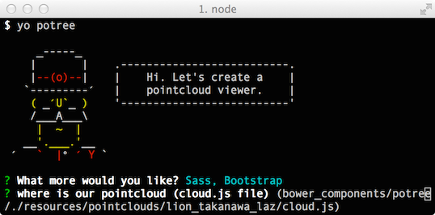
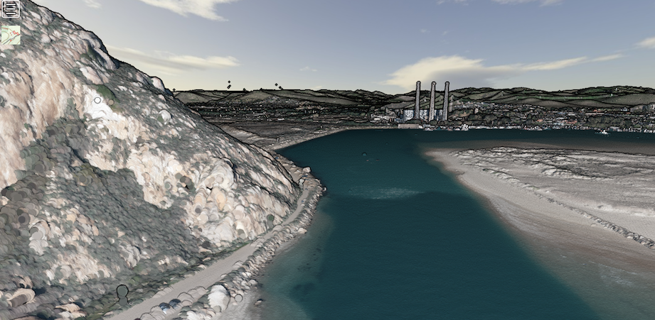

# generator-potree [![NPM version][npm-image]][npm-url] [![Build Status][travis-image]][travis-url] [![Dependency Status][daviddm-image]][daviddm-url] [![Coverage percentage][coveralls-image]][coveralls-url]
> Generator for potree websites

## Installation

This generator makes use of a few other software packages. So you ...
    have to install these first.

* node.js [node.js](https://nodejs.org/)

Then with node installed you should have the node package manager ...
    available. This provides you with the `npm` command.

With the npm command available you can install [Bower](http://bower.io), [Gulp](http://gulpjs.com), [Babel](http://babeljs.io), and [Yeoman](http://yeoman.io) and generator-potree using [npm](https://www.npmjs.com/). It's common practice to install everything as a user, not as root.

```bash
npm install -g bower
npm install -g gulp
npm install -g babel-cli
npm install -g yo
npm install -g generator-potree
```

The last command will work once we register this module at npm. For ...
    now and when developing you can use the source code version.

```bash
cd generator-potree
npm link
```

Then generate your new project:

```bash
yo potree
```

This should show an interactive screen (in the command line) where you can answer a few technical questions. The result should be a website generated in your directory. You can start a local test server. If you want to deploy to another website you can build a static website.

```bash
# local server
gulp serve
# build a static website
gulp build
```


## Getting To Know Yeoman

Yeoman has a heart of gold. He&#39;s a person with feelings and opinions, but he&#39;s very easy to work with. If you think he&#39;s too opinionated, he can be easily convinced. Feel free to [learn more about him](http://yeoman.io/).

## License

Generator is based on an example in [potree](https://github.com/potree/potree) and on the [gulp-webapp](https://github.com/yeoman/generator-gulp-webapp) generator.
GPLv3 © [Fedor Baart](http://oss.deltares.nl) on parts that are new.

## Screenshot



[npm-image]: https://badge.fury.io/js/generator-potree.svg
[npm-url]: https://npmjs.org/package/generator-potree
[travis-image]: https://travis-ci.org/SiggyF/generator-potree.svg?branch=master
[travis-url]: https://travis-ci.org/SiggyF/generator-potree
[daviddm-image]: https://david-dm.org/SiggyF/generator-potree.svg?theme=shields.io
[daviddm-url]: https://david-dm.org/SiggyF/generator-potree
[coveralls-image]: https://coveralls.io/repos/SiggyF/generator-potree/badge.svg
[coveralls-url]: https://coveralls.io/r/SiggyF/generator-potree
